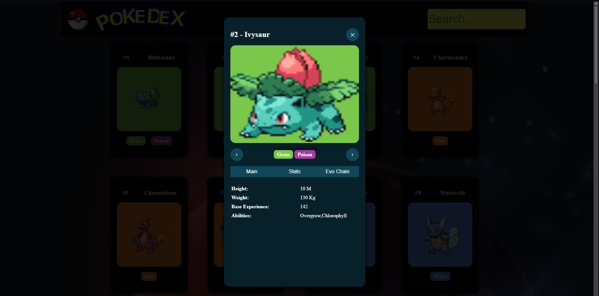

# Pokedex

Pokémon-Datenbank mit Anbindung an die [PokéAPI](https://pokeapi.co/). Übersicht mit Nachladen, Detailansicht mit Werten und Entwicklungsreihe, Suche.

**Live:** [join.alexander-bartmann.de](https://join.alexander-bartmann.de)



---

## Tech Stack

Vanilla JavaScript (ES6) · HTML · CSS · PokéAPI

Ohne Framework und ohne Build-Prozess. Die gesamte Datenverarbeitung, das Rendering und die Zustandsverwaltung sind selbst geschrieben.

---

## Features

- Übersicht mit 30 Pokémon pro Ladevorgang, weitere per Button
- Detailansicht mit Basiswerten als Balkendiagramm, Größe, Gewicht, Fähigkeiten
- Entwicklungsreihe über verkettete API-Abfragen
- Navigation zwischen Pokémon direkt in der Detailansicht
- Suche nach Namen
- Typenfarben nach offiziellem Schema
- Responsive bis 375px

---

## Technische Umsetzung

**Datenbeschaffung über zwei Ebenen.** Die PokéAPI liefert bei der Übersichtsabfrage nur Namen und URLs — Bild, Typen und Werte stehen erst in der Detailantwort. Für jede Karte ist deshalb ein zweiter Request nötig.

**Caching.** Jedes einmal geladene Pokémon landet in einem Objekt, das als Zwischenspeicher dient:

```js
async function fetchPokemonData(url) {
    const pokemonId = url.split('/')[6];
    if (cachedPokemons[pokemonId]) {
        return cachedPokemons[pokemonId];
    }
    const response = await fetch(url);
    const pokemonData = await response.json();
    cachedPokemons[pokemonId] = pokemonData;
    return pokemonData;
}
```

Dadurch entsteht beim Blättern durch die Detailansicht kein neuer Request für bereits geladene Einträge. Bei über tausend Pokémon spart das spürbar Ladezeit.

**Entwicklungsreihe.** Die Kette steht nicht am Pokémon selbst, sondern hinter zwei weiteren Ressourcen: erst die Spezies abfragen, von dort die Evolution-Chain, und die enthält wiederum nur Namen — für die Bilder braucht es einen dritten Aufruf pro Stufe.

**Pagination** über `offset` und `limit` als Query-Parameter. Der Button wird während des Ladens deaktiviert, damit mehrfaches Klicken keine doppelten Einträge erzeugt.

**Struktur.** Logik in `script.js`, HTML-Erzeugung in `template.js`, Typenfarben in `typesJSON.js`. Die Trennung hält die Funktionen kurz und macht Änderungen an der Darstellung unabhängig von der Logik.

---

## Was ich dabei gelernt habe

Der Umgang mit asynchronen Abläufen war der Kern: Requests, die aufeinander aufbauen, `await` in Schleifen, und die Frage, wann man Daten zwischenspeichert statt sie erneut zu holen.

Dazu kam, dass eine API selten die Form liefert, die man für die Anzeige braucht. Ein großer Teil der Arbeit bestand darin, verschachtelte Antwortstrukturen auf das herunterzubrechen, was die Oberfläche tatsächlich anzeigt.

---

## Nächste Schritte

Bewusst offen gelassen:

- **Ladebildschirm an den tatsächlichen Ladevorgang koppeln** — aktuell läuft er über eine feste Zeitspanne, statt auf die abgeschlossenen Requests zu warten
- **Suche über den gesamten Datenbestand** statt nur über die geladene Seite
- **Fehlerbehandlung** bei nicht erreichbarer API
- **Event-Listener statt Inline-Handler** — die Daten werden derzeit als String ins `onclick`-Attribut geschrieben, sauberer wäre eine Referenz über die ID

---

## Zum Projekt

Projekt der Developer Akademie. Aufgabenstellung vorgegeben, Umsetzung von mir.

---

**Alexander Bartmann**
[alexander-bartmann.de](https://alexander-bartmann.de)
